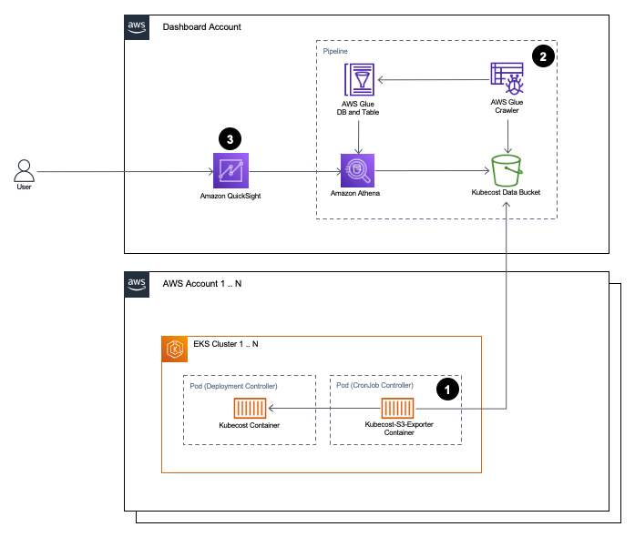

# Architecture

The following is the solution's architecture:

## Solution's Components

The solution is composed of the following resources (note - deployment instructions can be found later in the documentation):

1. A data collection pod (referred to as "Kubecost S3 Exporter" throughout some parts of the documentation).  
This project deploys a CronJob controller and a Service Account to each EKS cluster you choose.  
The CronJob controller creates the data collection pod on a schedule.  
These components are used to collect data from Kubecost.
2. A pipeline that is composed of the following components:
   1. An Amazon S3 bucket that stores the Kubecost data
   2. AWS Glue database, table and crawler
   3. Amazon Athena workgroup
   4. Relevant IAM roles and policies 
   5. AWS Secrets Manager secret.  
   Optional, used for storing root CA certificate when TLS is enabled on Kubecost frontend container
3. Amazon QuickSight dashboard, data source and dataset

Most of the above components are deployed using a Terraform module.  
The K8s resources are deployed using a Helm chart (that is invoked by the Terraform module or by the user).  
The QuickSight dashboard is deployed using the `cid-cmd` CLI tool.  
Deployment instructions can be found in the [`DEPLOYMENT.md`](DEPLOYMENT.md) file

## High-Level Logic

1. The CronJob K8s controller runs daily and creates a pod that collects cost allocation data from Kubecost.  
It uses the [Kubecost Allocation API](https://docs.kubecost.com/apis/apis-overview/api-allocation) to retrieve the cost allocation data.  
In most cases, it collects the data between 72 hours ago 00:00:00 and 48 hours ago 00:00:00.  
In some cases it may collect more, if it identifies gaps between the data available in Kubecost and in the S3 bucket.  
Once data is collected, it's then converted to a Parquet, compressed and uploaded to an S3 bucket of your choice.
2. The data is made available in Athena using AWS Glue database, table and crawler.  
The crawler runs daily (using a defined schedule), to create or update partitions.
3. QuickSight uses the Athena table as a data source to visualize the data.  
The data in the QuickSight dataset is refreshed daily according to a defined schedule.

## Authentication Logic

### IAM Roles for Service Account

This solution uses IRSA for authentication with AWS resources.  
The authentication flow changes according to the following conditions:

* The EKS cluster and the target resource (S3 bucket or Secret Manager secret) are in the same account:  
In this case, the Terraform module creates one IAM Role for Service Account in the EKS cluster's account.
The Kubecost S3 Exporter script will assume the role and perform the relevant actions.
* The EKS cluster and the target resource (S3 bucket or Secret Manager secret) are in different accounts:
In this case, the Terraform module creates two IAM roles:
A child IAM Role Service Account in the EKS cluster's account, and parent IAM role in the pipline account.  
The Kubecost S3 Exporter script will first assume the child role, then the parent role, and perform the relevant actions.  
This is referred to as IAM role chaining, and is used to support cross-account authentication. 

**_Important Note:_**  
The inline policy created for the IRSA includes some wildcards.  
The reason for using these wildcards is to specify:
* All months (part of the S3 bucket prefix)
* All years (part of the S3 bucket prefix)
* All dates in the Parquet file name that is being uploaded to the bucket

Even with these wildcards, the policy restricts access only to a very specific prefix of the bucket.  
This is done specifying the account ID, region and EKS cluster name as part of the resource in the inline policy.  
This is possible because the prefix we use in the S3 bucket includes the account and region for each cluster, and the Parquet file name includes the EKS cluster name.

### S3 Bucket Policy

In addition, a sample S3 bucket policy is provided as part of this documentation.  
This is for the bucket that is used to store the Kubecost data.  
See ["Using an S3 Bucket Policy on the Kubecost Data Bucket" in the SECURITY.md file](SECURITY.md/.#using-an-s3-bucket-policy-on-the-kubecost-data-bucket).  
The Terraform module that's provided with this solution does not create it, because it doesn't create the S3 bucket.  
It's up to you to use it on your S3 bucket. 

## Kubecost APIs Used by this Project

This project uses the [Kubecost Allocation API](https://docs.kubecost.com/apis/apis-overview/api-allocation) to retrieve the cost allocation data

## Back-filling Past Data

This solution supports back-filling past data up to the Kubecost retention limits (15 days for the free tier).  
The back-filling is done automatically by the data collection pod if it identifies gaps in the S3 data compared to the Kubecost data.  
The way it works is as follows:

1. An environment variable is passed to the data collection pod (`BACKFILL_PERIOD_DAYS` in Helm, `backfill_period_days` in Terraform).  
The default value is 15 days (according to the Kubecost free tier retention limit), but it can be changed.
2. Every time the data collection pod runs, it performs the following:
   1. Identifies the available data in Kubecost for the back-fill period.  
   This is done by querying the Allocation API for the given period, in daily granularity and `cluster` aggregation.  
   This API call intentionally uses high granularity and high aggregation levels, because the cost data isn't the purpose of this call.  
   The purpose of this call is to identify the dates where Kubecost data is available.
   2. Identifies the available data in the S3 bucket for the back-fill period.  
   This is done by querying Amazon S3 API for the given bucket, using the `s3:ListObjectV2` API call.  
   The dates are then extracted from the Parquet files names.
   3. The dates extracted from Kubecost Allocation API and Amazon S3 `s3:ListObjectV2` API are compared.  
   If there are dates in the Kubecost API response that aren't available in the S3 bucket, data collection is performed from Kubecost for these dates.

On a regular basis, this logic is simply used to perform the daily data collection.  
It'll always identify one day gap between Kubecost and S3, and will collect the missing day.  
However, in cases of missing data for other dates, the above logic is used to back-fill the missing data.  
This is instead of simply running the data collection always on a given timeframe (e.g., 3 days ago), which will only work for daily collection.  
This automatic back-filling solution can fit the following use-cases:

1. Back-filling data for a newly deployed data collection pod, if Kubecost was already deployed on the same cluster for multiple days
2. Back-filling data for clusters that are regularly powered off for certain days:  
On the days they're powered off, the data collection pod isn't running, and therefore isn't collecting the data relative to those dates (3 days back).  
The missing data will be automatically back-filled the next time the job runs after the cluster was powered back up.
3. Back-filling for failed jobs:  
It could be that the data collection pod failed for some reason, more than the maximum number of job failures.  
Assuming the issue is fixed within the Kubecost retention limit, the missing data will be back-filled automatically the next time the job runs successfully.
4. Back-filling for accidental deletion of Parquet files:  
If Parquet files within the Kubecost retention limit timeframe were accidentally deleted, the missing data will be automatically back-filled.

Notes:

1. The back-filling solution supports back-filling data only up to the Kubecost retention limit (15 days for the free tier)
2. The back-filling solution is automatic, and does not support force-back-filling of data that already exists in the S3 bucket.  
If you'd like to force-back-fill existing data, you must delete the Parquet file for the desired date, and then run the data collection (please back up first).  
An example reason for such a scenario is that an issue was fixed or a feature was added to the solution, and you'd like it to be applied for past data.  
Notice that this is possible only up to the Kubecost retention limit (15 days for the free tier).
