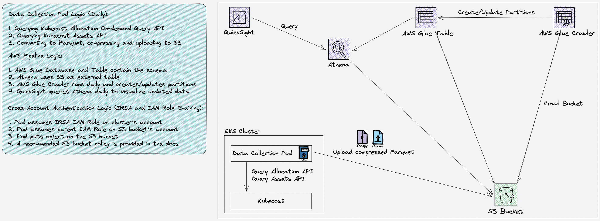
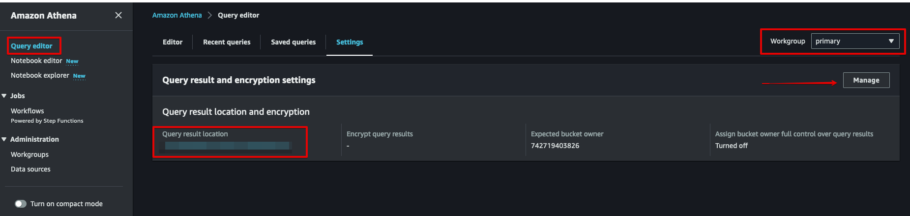
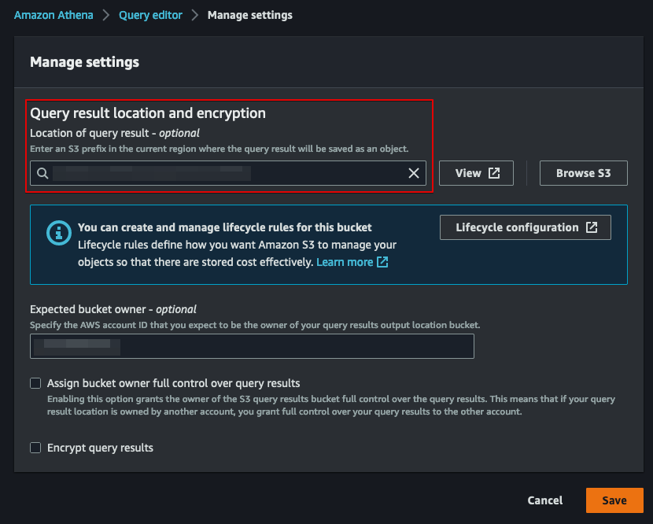
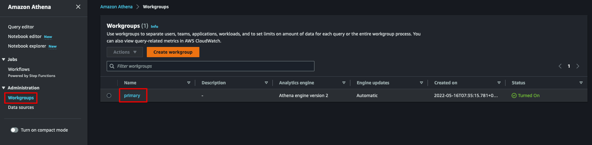
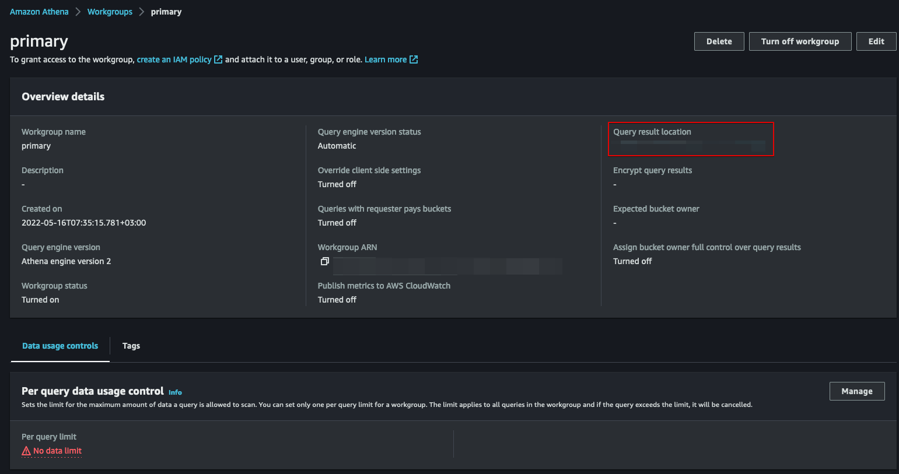
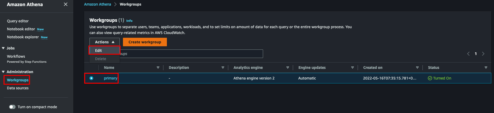
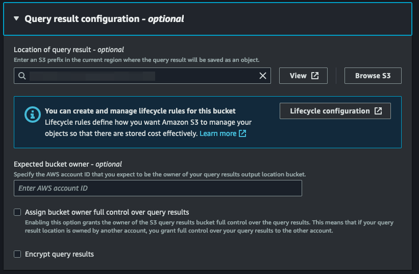

# EKS Insights Dashboard

This is an integration of Kubecost with AWS CID (Cloud Intelligence Dashboards) to create the EKS Insights Dashboard. 
This dashboard is meant to provide a breakdown of the EKS in-cluster costs in multi-cluster environment, in a single-pane-of-glass alongside the other CID dashboards.

## Architecture

The following is the solution's architecture:

### Solution's Components

The solution is composed of the following resources:

* An S3 bucket that stores the Kubecost data (should be pre-created, see "Requirements" section)
* A CronJob controller (that is used to create a data collection pod) and Service Account. 
Both should be deployed on each EKS cluster, using a Terraform module (that invokes Helm) that is provided as part of this solution. 
You can also deploy these resources directly using the Helm chart that is provided as part of this solution. 
The data collection pod is referred to as Kubecost S3 Exporter throughout some parts of the documentation.
* The following AWS resources (all are deployed using a Terraform module that is provided as part of this solution):
  * IAM Role for Service Account (in the EKS cluster's account) and a parent IAM role (in the S3 bucket's account) for each cluster. 
    This is to support cross-account authentication between the data collection pod and the S3 bucket, using IAM role chaining. 
  * AWS Glue Database 
  * AWS Glue Table
  * AWS Glue Crawler (along with its IAM Role and IAM Policy)
  * AWS Secrets Manager Secret (if TLS is enabled)

### High-Level Logic

1. The CronJob K8s controller runs daily and creates a pod that collects cost allocation data from Kubecost. It runs the following API calls: 
The [Allocation On-Demand API (experimental)](https://docs.kubecost.com/apis/apis-overview/allocation#querying-on-demand-experimental) to retrieve the cost allocation data. 
The [Assets API](https://docs.kubecost.com/apis/apis-overview/assets-api) to retrieve the assets' data. 
It always collects the data between 72 hours ago 00:00:00 and 48 hours ago 00:00:00. 
2. Once data is collected, it's then converted to a Parquet, compressed and uploaded to an S3 bucket of your choice. This is when the CronJob finishes 
3. The data is made available in Athena using AWS Glue Database, AWS Glue Table and AWS Glue Crawler. 
The AWS Glue Crawler runs daily (using a schedule that you define), to create or update partitions.
4. QuickSight uses the Athena table as a data source to visualize the data

### Cross-Account Authentication Logic

This solution uses IRSA with IAM role chaining, to support cross-account authentication. 
For each EKS cluster, the Terraform module that's provided with this solution, will create:

* A child IRSA IAM role in the EKS cluster's account and region
* A parent IAM role in the S3 bucket's account

The child IRSA IAM role will have a Trust Policy that trusts the IAM OIDC Provider ARN. 
It's also specifically narrowed down using `Condition` element, to trust it only from the relevant K8s Service Account and Namespace. 
The inline policy of the IRSA IAM role allows only the `sts:AssumeRole` action, only for the parent IAM role that was created for this cluster. 

The parent IAM role will have a Trust Policy that only trusts the chile IAM role ARN. 
The inline policy of the parent IAM role allows only the `s3:PutObject` action, only on the S3 bucket and specific prefix where the Kubecost files for this cluster are expected to be stored.

In addition, an S3 bucket policy sample is provided as part of this documentation (see below "S3 Bucket Specific Notes" section). 
The Terraform module that's provided with this solution does not create it, because it doesn't create the S3 bucket. 
It's up to you to use it on your S3 bucket. 

### Kubecost APIs Used by this Solution

The Kubecost APIs that are being used are:

* The [Allocation On-Demand API (experimental)](https://docs.kubecost.com/apis/apis-overview/allocation#querying-on-demand-experimental) to retrieve the cost allocation data
* The [Assets API](https://docs.kubecost.com/apis/apis-overview/assets-api) to retrieve the assets' data - specifically for the nodes

For clarifications on issues that may be encountered when querying the Allocation On-Demand API (such as slow response time or memory issues): 
Please see the "Clarifications on the Allocation On-Demand API" part on the Appendix. 

### Encrypting Data In-Transit

This solution supports encrypting the data between the data collection pod and the Kubecost pod, in-transit. 
To enable this, please follow the "Enabling Encryption In-Transit Between the Data Collection Pod and Kubecost Pod" section in the Appendix.

## Requirements

1. An S3 bucket, which will be used to store the Kubecost data
2. QuickSight Enterprise with CID deployed
3. Terraform and Helm installed
4. The `cid-cmd` tool ([install with PIP](https://pypi.org/project/cid-cmd/)) installed

For each EKS cluster, have the following:

1. An [IAM OIDC Provider](https://docs.aws.amazon.com/eks/latest/userguide/enable-iam-roles-for-service-accounts.html). 
The IAM OIDC Provider must be created in the EKS cluster's account and region.
2. Kubecost deployed in the EKS cluster. 
Currently, only the free tier and the EKS-optimized bundle of Kubecost are supported. 
The get the most accurate cost data from Kubecost (such as RIs, SPs and Spot), it's recommended to [integrate it with CUR](https://docs.kubecost.com/install-and-configure/install/cloud-integration/aws-cloud-integrations). 
To get network costs, please follow the [Kubecost network cost allocation guide](https://docs.kubecost.com/using-kubecost/getting-started/cost-allocation/network-allocation) and deploy [the network costs Daemonset](https://docs.kubecost.com/install-and-configure/advanced-configuration/network-costs-configuration).

Please continue reading the specific sections “S3 Bucket Specific Notes”, “Configure Athena Query Results Location” and “Configure QuickSight Permissions”. 

### S3 Bucket Specific Notes

You may create an S3 Bucket Policy on the bucket that you create to store the Kubecost data. 
In this case, below is a recommended bucket policy to use. 
This bucket policy, along with the identity-based policies of all the identities in this solution, provide minimum access:

    {
        "Version": "2012-10-17",
        "Statement": [
            {
                "Effect": "Deny",
                "Principal": "*",
                "Action": "s3:*",
                "Resource": [
                    "<your_kubecost_bucket_arn>",
                    "<your_kubecost_bucket_arn>/*"
                ],
                "Condition": {
                    "Bool": {
                        "aws:SecureTransport": "false"
                    },
                    "StringNotEquals": {
                        "aws:PrincipalArn": [
                            "arn:aws:iam::<account_id>:role/<your_bucket_management_role>",
                            "arn:aws:iam::<account_id>:role/kubecost_glue_crawler_role",
                            "arn:aws:iam::<account_id>:role/service-role/aws-quicksight-service-role-v0"
                        ],
                        "aws:PrincipalTag/irsa-kubecost-s3-exporter": "true"
                    }
                }
            }
        ]
    }

This S3 bucket denies all principals from performing all S3 actions, except the principals in the `Condition` section. 
The list of principals shown in the above bucket policy are as follows:

* The `arn:aws:iam::<account_id>:role/<your_bucket_management_role>` principal: 
This principal is an example of an IAM Role you may use to manage the bucket.
Add the IAM Roles that will allow you to perform administrative tasks on the bucket.
* The `arn:aws:iam::<account_id>:role/kubecost_glue_crawler_role` principal: 
This principal is the IAM Role that will be attached to the Glue Crawler when it's created by Terraform. 
You must add it to the bucket policy, so that the Glue Crawler will be able to crawl the bucket.
* The `arn:aws:iam::<account_id>:role/service-role/aws-quicksight-service-role-v0` principal: 
This principal is the IAM Role that will be automatically created for QuickSight. 
If you use a different role, please change it in the bucket policy. 
You must add this role to the bucket policy, for proper functionality of the QuickSight dataset that is created as part of this solution.
* The `aws:PrincipalTag/irsa-kubecost-s3-exporter": "true"` condition: 
This condition identifies all the EKS clusters from which the Kubecost S3 Exporter pod will communicate with the bucket. 
When Terraform creates the IAM roles for the pod to access the S3 bucket, it tags the parent IAM roles with the above tag. 
This tag is automatically being used in the IAM session when the Kubecost S3 Exporter pod authenticates. 
The reason for using this tag is to easily allow all EKS clusters running the Kubecost S3 Exporter pod, in the bucket policy, without reaching the bucket policy size limit. 
The other alternative is to specify all the parent IAM roles that represent each cluster one-by-one. 
With this approach, the maximum bucket policy size will be quickly reached, and that's why the tag is used.

The resources used in this S3 bucket policy include:

* The bucket name, to allow access to it
* All objects in the bucket, using the `arn:aws:s3:::kubecost-data-collection-bucket/*` string. 
The reason for using a wildcard here is that multiple principals (multiple EKS clusters) require access to different objects in the bucket. 
Using specific objects for each principal will result in a longer bucket policy that will eventually exceed the bucket policy size limit. 
The identity policy (the parent IAM role) that is created as part of this solution for each cluster, specifies only the specific prefix and objects. 
Considering this, the access to the S3 bucket is more specific than what's specified in the "Resources" part of this bucket policy.

### Configure Athena Query Results Location

To set the Athena Query Results Location, follow both steps below.

#### Step 1: Set Query Results Location in the Athena Query Editor

Navigate to Athena Console -> Query Editor -> Settings:

If the "Query result location" field is empty, click "Manage". 
Then, set the Query result location, optionally (recommended) encrypt the query results, and save:

#### Step 2: Set Query Results Location in the Athena Workgroup Settings

Navigate to Athena Console -> Administration -> Workgroups:

Click on the relevant Workgroup, and you'll see the Workgroup settings:

If the "Query result location" field is empty, go back to the Workgroups page, and edit the Workgroup settings:

In the settings page, set the Query results location, optionally (recommended) encrypt the query results, and save:

### Configure QuickSight Permissions

1. Navigate to “Manage QuickSight → Security & permissions”
2. Under “Access granted to X services”, click “Manage”
3. Under “S3 Bucket”, check the S3 bucket you create, and check the “Write permissions for Athena Workgroup” for this bucket

Note - if at step 2 above, you get the following error:

*Something went wrong*
*For more information see Set IAM policy (https://docs.aws.amazon.com/console/quicksight/iam-qs-create-users)*

1. Navigate to the IAM console
2. Edit the QuickSight-managed S3 IAM Policy (usually named `AWSQuickSightS3Policy`)
3. Add the S3 bucket in the same sections of the policy where you have your CUR bucket

## Deployment

There are 3 high-level steps to deploy the solution:

1. Build an image using `Dockerfile` and push it
2. Deploy both the AWS resources and the data collection CronJob using Terraform and Helm
3. Deploy the QuickSight dashboard using `cid-cmd` tool

### Step 1: Build and Push the Container Image

We do not provide a public image, so you'll need to build an image and push it to the registry and repository of your choice. 
For the registry, we recommend using Private Repository in Amazon Elastic Container Registry (ECR). 
You can find instructions on creating a Private Repository in ECR in [this document](https://docs.aws.amazon.com/AmazonECR/latest/userguide/repository-create.html).
The name for the repository can be any name you'd like - for example, you can use `kubecost-s3-exporter`. 
If you decided to use Private Repository in ECR, you'll have to configure your Docker client to log in to it first, before pushing the image to it. 
You can find instructions on logging in to a Private Repository in ECR using Docker client, in [this document](https://docs.aws.amazon.com/AmazonECR/latest/userguide/registry_auth.html). 

In this section, choose either "Build and Push for a Single Platform" or "Build and Push for Multiple Platforms".

#### Build and Push for a Single Platform

Build for a platform as the source machine:

    docker build -t <registry_url>/<repo>:<tag> .

Build for a specific target platform:

    docker build --platform linux/amd64 -t <registry_url>/<repo>:<tag> .

Push:

    docker push <registry_url>/<repo>:<tag>

#### Build and Push for Multiple Platforms

    docker buildx build --push --platform linux/amd64,linux/arm64/v8 --tag <registry_url>/<repo>:<tag> .

### Step 2: Deploy the AWS and K8s Resources

This solution currently provides a Terraform module for deployment of both the AWS the K8s resources. 
There are 2 options to use it:
* Deployment Option 1: Deploy both the AWS resources and the K8s resources using Terraform (K8s resources are deployed by invoking Helm)
* Deployment Option 2: Deploy only the AWS resources using Terraform, and deploy the K8s resources using the `helm` command. 
With this option, Terraform will create a cluster-specific `values.yaml` file (with a unique name) for each cluster, which you can use

You can use a mix of these options. 
On some clusters, you can choose to deploy the K8s resources by having Terraform invoke Helm (the first option). 
On other clusters, you can choose to deploy the K8s resources yourself using the `helm` command (the second option).

#### Deployment Option 1

With this deployment option, Terraform deploys both the AWS resources and the K8s resources (by invoking Helm).

Please follow the instructions under `terraform/kubecost_cid_terraform_module/README.md`. 
For the initial deployment, you need to go through the "Requirements", "Structure" and "Initial Deployment" sections. 
Once you're done with Terraform, continue to step 3 below.

#### Deployment Option 2

With this deployment option, Terraform deploys only the AWS resources, and the K8s resources are deployed using the `helm` command.

1. Please follow the instructions under `terraform/kubecost_cid_terraform_module/README.md`. 
For the initial deployment, you need to go through the "Requirements", "Structure" and "Initial Deployment" sections. 
When reaching the "Create an Instance of the `kubecost_s3_exporter` Module and Provide Module-Specific Inputs", do the following: 
Make sure that as part of the optional module-specific inputs, you use the `invoke_helm` input with value of `false`.

2. After successfully executing `terraform apply` (the last step - step 4 - of the "Initial Deployment" section), Terraform will create the following:  
Per cluster for which you used the `invoke_helm` input with value of `false`, a YAML file will be created containing the Helm values for this cluster. 
The YAML file for each cluster will be named `<cluster_account_id>_<cluster_region>_<cluster_name>_values.yaml`. 
The YAML files will be created in the `helm/kubecost_s3_exporter/clusters_values` directory.

3. For each cluster, deploy the K8s resources by executing Helm

Executing Helm when you're still in the Terraform `deploy` directory

    helm upgrade -i kubecost-s3-exporter ../../../helm/kubecost_s3_exporter/ -n <namespace> --values ../../../helm/kubecost_s3_exporter/clusters_values/<cluster>.yaml --create-namespace --kube-context <cluster_context>

Executing Helm when in the `helm` directory

    helm upgrade -i kubecost-s3-exporter kubecost_s3_exporter/ -n <namespace> --values kubecost_s3_exporter/clusters_values/<cluster>.yaml --create-namespace --kube-context <cluster_context>

Once you're done, continue to step 3 below.

### Step 3: Dashboard Deployment

From the `cid` folder, run `cid-cmd deploy --resources eks_insights_dashboard.yaml`. 
The output should be similar to the below:

    CLOUD INTELLIGENCE DASHBOARDS (CID) CLI 0.2.3 Beta
    
    Loading plugins...
        Core loaded
        Internal loaded
    
    
    Checking AWS environment...
        profile name: <profile_name>
        accountId: <account_id>
        AWS userId: <user_id>
        Region: <region>
    
    
    
    ? [dashboard-id] Please select dashboard to install: (Use arrow keys)
       [cudos] CUDOS Dashboard
       [cost_intelligence_dashboard] Cost Intelligence Dashboard
       [kpi_dashboard] KPI Dashboard
       [ta-organizational-view] Trusted Advisor Organizational View
       [trends-dashboard] Trends Dashboard
       [compute-optimizer-dashboard] Compute Optimizer Dashboard
     » [eks_insights] EKS Insights

From the list, choose `[eks_insights] EKS Insights`. 
After choosing, wait for dashboards discovery to be completed, and then the additional output should be similar to the below:

    ? [dashboard-id] Please select dashboard to install: [eks_insights] EKS Insights
    Discovering deployed dashboards...  [####################################]  100%  "CUDOS Dashboard" (cudos)
    
    Required datasets:
     - eks_insights
    
    
    Looking by DataSetId defined in template...complete
    
    There are still 1 datasets missing: eks_insights
    Creating dataset: eks_insights
    Detected views:
    
    ? [athena-database] Select AWS Athena database to use: (Use arrow keys)
       <cur_db>
     » kubecost_db
       spectrumdb

From the list, choose the Athena database that was created by the Terraform template. 
If you didn't change the AWS Glue Database name in the Terraform template, then it'll be `kubecost_db` - please choose it.
After choosing, wait for the dataset to be created, and then the additional output should be similar to the below:

    ? [athena-database] Select AWS Athena database to use: kubecost_db
    Dataset "eks_insights" created
    Latest template: arn:aws:quicksight:<region_code>:<account_id>:template/eks_insights/version/1
    Deploying dashboard eks_insights
    
    #######
    ####### Congratulations!
    ####### EKS Insights is available at: https://<region_code>.quicksight.aws.amazon.com/sn/dashboards/eks_insights
    #######
    
    ? [share-with-account] Share this dashboard with everyone in the QuickSight account?: (Use arrow keys)
     » yes
       no

Choose whether to share the dashboard with everyone in this account. 
This selection will complete the deployment. 

Note: 
Data won't be available in the dashboard at least until the first time the data collection pod runs and collector data.
You must have data from at lest 72 hours ago in Kubecost for the data collection pod to collect data.

## Post-Deployment Steps

### Share the Dataset with Users

Share the dataset with users that are authorized to make changes to it:

1. Login to QuickSight, then click on the person icon on the top right, and click "Manage QuickSight"
2. On the left pane, navigate to "Manage assets", then choose "Datasets"
3. From the list, choose the `eks_insights` dataset (ID `e88edf48-f2cd-4c23-b6a4-e2b3034e2c41`)
4. Click "Share", select the desired permissions, start typing your user or group, select it and click "Share"
5. Navigate back to “Datasets” on the main QuickSight menus on the left, click the eks_insights dataset, and verify that the refresh status shows as “Completed” (It may take a few minutes to complete). 
Once it's completed - the dashboard is ready to be used, and you can navigate to “Dashboards”, click the EKS Insights dashboard, and start using the dashboard.

Please continue to the next steps to set dataset refresh (mandatory), and optionally share the dashboard with users and create an Analysis from the dashboard

### Set Dataset Refresh Schedule

A dataset refresh schedule needs to be set, so that the data from Athena will be fresh daily in QuickSight:

1. Login to QuickSight as a user that has "Owner" permissions to the dataset (you set it in the previous step)
2. Navigate to "Datasets" and click on the `eks_insights` dataset
3. Under "Refresh" tab, click "ADD NEW SCHEDULE"
4. Select "Incremental refresh", and click "CONFIGURE INCREMENTAL REFRESH"
5. On "Date column", make sure that "window.start" is selected
6. Set "Window size (number)" to "4", set "Window size (unit)" to "Days", and click "CONTINUE". 
Notice that any value that is less than "4" in the "Window size (number)" will miss some data.
7. Select "Timezone" and "Start time". 
Notice that these options set the refresh schedule. 
The refresh schedule should be at least 2 hours after the K8s CronJob schedule. 
This is because 1 hour after the CronJob runs, the AWS Glue Crawler runs. 
8. Set the "Frequency" to "Daily" and click "SAVE"

### Share the Dashboard with Users

To share the dashboard with users, for them to be able to view it and create Analysis from it, see the following link: 
https://wellarchitectedlabs.com/cost/200_labs/200_cloud_intelligence/postdeploymentsteps/share/

### Create an Analysis from the Dashboard

Create an Analysis from the Dashboard, to edit it and create custom visuals:

1. Login to QuickSight as a user that is allowed to save the dashboard as Analysis
2. Navigate to "Dashboards" and click the `EKS Insights`
3. On the top right, click the "Save as" icon (refresh the dashboard if you don't see it), name the Analysis, then click "SAVE" - you'll be navigated to the Analysis
4. You can edit the Analysis as you wish, and save it again as a dashboard, by clicking the "Share" icon on the top right, then click "Publish dashboard"

## Maintenance

After the solution is initially deployed, you might want to make changes. 
Below are instruction for some common changes that you might do after the initial deployment.

### Deploying on Additional Clusters

To add additional clusters to the dashboard, you need to add them to the Terraform module and apply it. 
Please follow the "Maintenance -> Deploying on Additional Clusters" part under `terraform/kubecost_cid_terraform_module/README.md`. 
Wait for the next schedule of the Kubecost S3 Exporter and QuickSight refresh, so that it'll collect the new data. 

Alternatively, you can run the Kubecost S3 Exporter on-demand according to "Running the Kubecost S3 Exporter Pod On-Demand" section. 
Then, manually run the Glue Crawler and manually refresh the QuickSight dataset.

### Adding/Removing Labels to/from the Dataset

After the initial deployment, you might want to add or remove labels for some or all clusters, to/from the dataset. 
To do this, perform the following:

1. Add/remove the labels to/from the Terraform module and apply it. 
Please follow the "Maintenance -> Adding/Removing Labels to/from the Dataset" part under `terraform/kubecost_cid_terraform_module/README.md`.
2. Wait for the next Kubecost S3 Exporter schedule so that it'll collect the labels. 
Alternatively, you can run the Kubecost S3 Exporter on-demand according to "Running the Kubecost S3 Exporter Pod On-Demand" section. 
3. Login to QuickSight, navigate to "Datasets", click on the `eks_insights` dataset, click "EDIT DATASET", and click "SAVE & PUBLISH". 
Wait the full refresh is done, and the new set of labels should be present in the analysis. 
For it to be available in the dashboard, export the analysis to a dashboard.

### Running the Kubecost S3 Exporter Pod On-Demand

In some cases, you'd like to run the Kubecost S3 Exporter pod on-demand. 
For example, you may want to test it, or you may have added some data and would like to see it immediately. 
To run the Kubecost S3 Exporter pod on-demand, run the following command (replace `<namespace>` with your namespace and `<context>` with your cluster ARN:

    kubectl create job --from=cronjob/kubecost-s3-exporter kubecost-s3-exporter1 -n <namespace> --context <context>

You can see the status by running `kubectl get all -n <namespace> --context <context>`

### Getting Logs from the Kubecost S3 Exporter Pod

To see the logs of the Kubecost S3 Exporter pod, you need to first get the list of pods by running the following command:

    kubectl get all -n <namespace> --context <context>

Then, run the following command to get the logs:

    kubectl logs <pod> -c kubecost-s3-exporter -n <namespace> --context <context>

## Troubleshooting

This section includes some common issues and possible solutions.

### The Data Collection Pod is in Status of `Completed`, But There's No Data in the S3 Bucket

The data collection container collects data between 72 hours ago 00:00:00.000 and 48 hours ago 00:00:00.000. 
Your Kubecost server still have missing data in this timeframe. 
Please check the data collection container logs, and if you see the below message, it means you still don't have enough data:

    <timestamp> ERROR kubecost-s3-exporter: API response appears to be empty.
    This script collects data between 72 hours ago and 48 hours ago.
    Make sure that you have data at least within this timeframe.

In this case, please wait for Kubecost to collect data for 72 hours ago, and then check again.

### The Data Pod Container is in Status of `Error`

This could be for various reasons. 
Below are a couple of scenarios caught by the data collection container, and their logs you should expect to see.

#### A Connection Establishment Timeout

In case of a connection establishment timeout, the container logs will show the following log:

    <timestamp> ERROR kubecost-s3-exporter: Timed out waiting for TCP connection establishment in the given time ({connection_timeout}s). Consider increasing the connection timeout value.

In this case, please check the following:

1. That you specified the correct Kubecost API endpoint in the `kubecost_api_endpoint` input.
This should be the Kubecost cost-analyzer service. 
Usually, you should be able to specify `http://<service_name>.<namespace_name>:[port]`, and this DNS name will be resolved.
The default service name for Kubecost cost-analyzer service is `kubecost-cost-analyzer`, and the default namespace it's created in is `kubecost`. 
The default port the Kubecost cost-analyzer service listens on is TCP 9090. 
Unless you changed the namespace, service name or port, you should be good with the default value of the `kubecost_api_endpoint` input. 
If you changed any of the above, make sure you change the `kubecost_api_endpoint` input value accordingly.
2. If the `kubecost_api_endpoint` input has the correct value, try increasing the `connection_timeout` input value
3. If you still get the same error, check network connectivity between the data collection pod and the Kubecost cost-analyzer service

#### An HTTP Server Response Timeout

In case of HTTP server response timeout, the container logs will show one of the following logs (depends on the API being queried):

    <timestamp> ERROR kubecost-s3-exporter: Timed out waiting for Kubecost Allocation On-Demand API to send an HTTP response in the given time ({read_timeout}s). Consider increasing the read timeout value.

    <timestamp> ERROR kubecost-s3-exporter: Timed out waiting for Kubecost Assets API to send an HTTP response in the given time ({read_timeout}s). Consider increasing the read timeout value.

If this is for the Allocation On-Demand API call, please follow the recommendations in the "Clarifications on the Allocation On-Demand API" part on the Appendix. 
If this is for the Assets API call, please try increasing the `kubecost_assets_api_read_timeout` input value.

## Cleanup

### QuickSight Cleanup

1. Delete any analysis you created from the dashboard
2. Delete the dashboard
3. Delete the dataset

### AWS and K8s Resources Cleanup

1. Follow the "Complete Cleanup" section in the Terraform README.md, located in the `terraform/kubecost_cid_terraform_module/README.md` directory
2. Manually remove the CloudWatch Log Stream that was created by the AWS Glue Crawler
3. Empty and delete the S3 bucket you created

### Helm K8s Resources Cleanup

For clusters on which the K8s resources were deployed using "Deployment Option 2", run the following Helm command per cluster:

    helm uninstall kubecost-s3-exporter -n <namespace> --kube-context <cluster_context>

### Remove Namespaces

For each cluster, remove the namespace by running `kubectl delete ns <namespace> --context <cluster_context>` per cluster.

## Appendix

### Clarifications on the Allocation On-Demand API

The [Allocation API On-Demand API](https://docs.kubecost.com/apis/apis-overview/allocation#querying-on-demand-experimental) is considered experimental, as mentioned in the referenced link. 
The reason this solution uses this API and not the [standard Allocation API endpoint](https://docs.kubecost.com/apis/apis-overview/allocation#allocation-api), is to fetch specific time range in hourly granularity. 
This solution relies on Kubecost's ability to integrate with the Cost and Usage Report (CUR). 
The CUR is being updated [**up to** 3 times a day](https://docs.aws.amazon.com/cur/latest/userguide/what-is-cur.html). The data recency in the update might be back a few hours from the update time. 
Since Kubecost shows updated cost data up to almost now, it means there could be a gap between Kubecost's data and CUR's data for up to 48 hours. 
Till Kubecost reconciles the data from CUR with its data, it'll show on-demand costs.

This solution, intends to show accurate container costs that reflect not only on-demand, but also RIs, Savings Plans and Spot. 
This means that for this to work, the daily data collection must always collect data from 48 hours ago. 
To be more precise, it must collect data from between 72 hours ago 00:00:00.000 to 48 hours ago 00:00:00.000. 
This solution also intends to show up to hourly granularity of the costs. 
This means that the data collection must provide an option to retrieve the data from Kubecost in hourly granularity. 
Lastly, this solution intends to show container-level cost data, which means the amount of data fetched can be large (as opposed to using higher-level aggregations).

The Kubecost standard Allocation API endpoint doesn't have an input to specify the time granularity. 
Instead, it uses time granularity based on the `window` input. 
For example, a `window` of `24h` will return data in hourly granularity, and a `window` of `3d` will return data in daily granularity. 
We don't use this kind of window, and instead, we use a time range window (as mentioned above). 
With this type of window, Kubecost can't automatically detect the granularity, so it returns an accumulated cost for the whole time range. 
Alternatively, we could specify `72h` window (to get hourly granularity) and get the specific time range at parsing level. 
However, Kubecost standard Allocation API endpoint has a limitation where it returns data in hourly granularity only for `window` of up to `48h`.

As opposed to the standard Allocation API endpoint, the Allocation On-Demand API endpoint has a `step` input. 
This gives us the flexibility to specify a hourly granularity (with `step` set to `1h`), even for a time-range window. 
However, this comes with a performance tradeoff, as it computes everything on-demand. 
This is as opposed to the standard Allocation API endpoint which uses precomputed sets with predefined step sizes. 
This can cause long HTTP response times (for the API calls we make), as well as serious Prometheus performance issues, including OOM errors.

Due to our requirement for CUR data parity and hourly granularity, we chose the Allocation On-Demand API. 
To avoid the possible issues that may be caused by using this API, we provide the following means as part of this solution:

* Ability to set the API call's read timeout, using the `kubecost_allocation_api_read_timeout` Terraform input (`KUBECOST_ALLOCATION_API_READ_TIMEOUT` Helm input). 
The read timeout defines the time to wait for the server to return an HTTP response, and provides ability to set high read timeout. 
This is useful in cases of large clusters where Kubecost Allocation On-Demand API will take time to compute the data before returning a response. 
The default read timeout is 60 seconds, and can be changed on per cluster basis. 
* Ability to paginate using the `kubecost_allocation_api_paginate` Terraform input (`KUBECOST_ALLOCATION_API_PAGINATE` Helm input). 
Kubecost doesn't provide a native pagination functionality on this API. 
In some cases, returning large volumes of data may cause OOM errors. 
So, setting the read timeout to a large value to allow for a long processing time solves one issue, but causes another issue. 
To avoid possible OOM errors, this solution implements pagination by querying 1-hour time ranges within the 24-hour range it queries. 
This means that with pagination enabled, the data collection will perform 24 API calls and will concatenate them to a single data set. 
This means a potentially longer time to finish the retrieving all data (due to multiple request-response transactions over the network). 
However, in this expense, we reduce the risk for OOM errors because we retrieve smaller set of data on every API call. 
Pagination is disabled by default, and can be enabled on per cluster basis.
* Ability to define query resolution using the `kubecost_allocation_api_resolution` Terraform input (`KUBECOST_ALLOCATION_API_RESOLUTION` Helm input). 
This provides the ability to make tradeoffs between accuracy and performance. 
The default value is `1m`, and it can be changed on per cluster basis. 
For more information on this functionality from Kubecost's documentation, see [Theoretical error bounds](https://docs.kubecost.com/apis/apis-overview/allocation#theoretical-error-bounds) in the Allocation On-Demand API documentation.
* Ability to choose higher-level response aggregation, using the `aggregation` Terraform input (`AGGREGATION` Helm input). 
Although we intend to collect container-level cost data to provide the most granular data set, we provide an option to choose the aggregation. 
This can potentially reduce the amount of data that needs to be returned by Kubecost, which means less time for Kubecost to process it. 
This can reduce the risk for OOM errors, and also reduce the time it takes for the API to respond (hence, you could reduce the `kubecost_allocation_api_read_timeout`). 
The default value is `container`, and it can be changed on per cluster basis, to different higher level aggregation options (such ash pod, namespace). 
Using different aggregation option on different cluster will NOT cause issues on the data set, so feel free to use different options on different clusters. 
Please note that using aggregation higher than `container` will prevent using container right-sizing features of this solution for the respective clusters.
* Ability to specify daily time granularity using the `granularity` Terraform input (`GRANULARITY` Helm input). 
Although we intend to provide hourly granularity for accurate data, we provide an option to choose the time granularity. 
This can dramatically reduce the amount of data that needs to be returned by Kubecost, which means less time for Kubecost to process it. 
This can reduce the risk for OOM errors, and also reduce the time it takes for the API to respond (hence, you could reduce the `kubecost_allocation_api_read_timeout`). 
The default value is `hourly`, and it can be changed globally, only on the `common` Terraform module. 
Please DO NOT change it manually on an individual cluster basis on Helm. 
Please note that changing the time granularity to `daily` will reduce the ability to investigate costs for short-term containers.

We recommend approaching the problems outlined above, as follows:

1. Run the data collection container for the first time, with the default settings, on a dev cluster. 
If the Allocation On-Demand API fails to return an HTTP response in the given time, you'll see an error as in the "An HTTP Server Response Timeout" section. 
In this case, increase the `kubecost_allocation_api_read_timeout` incrementally, till you receive a response.
2. Based on the time it takes the Allocation On-Demand API to return (can be seen in the data collection container logs), adjust the read timeout on larger clusters. 
3. If you observe a too high memory usage on the Kubecost pod or Prometheus, or OOM errors on them, enable pagination for the cluster
4. If the above doesn't help, change the `kubecost_allocation_api_resolution` input to more than `1m` (do it incrementally till you see improvement)
5. If the above doesn't help, use higher level aggregation using the `aggreagation` input (for example, "pod" or "namespace") for the cluster
6. If the above doesn't help, move to daily granularity as a last resort (this will affect all clusters). 
Do so by changing the default value of the `granularity` input in the `common` module to `daily`

### Enabling Encryption In-Transit Between the Data Collection Pod and Kubecost Pod

By default, the Kubecost cost-analyzer-frontend service uses HTTP service to serve the UI/API endpoints, over TCP port 9090. 
For secure communication between the data collection pod and the Kubecost service, it's recommended to encrypt the data in-transit. 
To do that, you first need to enable TLS in Kubecost, and then enable communication over HTTPS in the data collection pod. 
Below you'll find the necessary steps to take.

#### Enabling TLS in the Kubecost

At the time of writing this document, Kubecost doesn't have any public documentation on enabling TLS. 
This section will help you go through enabling TLS in Kubecost. 
This section does not intend to replace the Kubecost user guide, and if you have any doubts, please contact Kubecost support.

To enable TLS in Kubecost, please take the following steps:

1. Create a TLS Secret in the Kubecost namespace, for the server certificate and private key you intend to use in Kubecost. 
You can use the below `kubectl` command [1] to create the Secret object: 
Note that the private key must have no passphrase, otherwise, you'll get `error: tls: failed to parse private key` error when executing this command. 
It's advised that you'll use a server certificate that's signed by a root CA certificate, and not a self-signed certificate.

2. Enable TLS in Kubecost by changing the below values [2] in the Kubecost Helm chart. 
See full `helm` command example below [3]. 
Once the Helm upgrade finishes successfully, you should see the Kubecost service listens on port 443. 
See example of the `kubectl get services` command output below [4].

#### Enabling TLS Communication in the Data Collection Pod

Enabling TLS in the data collection pod is done on per pod basis on each cluster. 
This is because the same is done on per pod basis in Kubecost, and Kubecost is installed separately on each cluster. 
Please take the following steps to enable TLS communication in the data collection pod:

1. In the `deploy/main.py` file, add the `kubecost_api_endpoint` variable to the module instance for the cluster.  
By default, if you don't add this variable to the module instance, the data collection pod uses `http://kubecost-cost-analyzer.kubecost:9090` to communicate with Kubecost. 
The URL you should to make sure the data collection pod uses TLS and use TCP port 443, must start with `https`. 
For example, use `https://kubecost-cost-analyzer.kubecost` (not port at the end means TCP port 443).
2. If you're using a self-signed server certificate in Kubecost (as doe in step 1 above), disable TLS verification in the data collection pod. 
Do so by adding `tls_verify` variable with value of `false`, in the module instance in `deploy/main.tf`.
The default value of `tls_verify` is `true`. 
This means that if the `kubecost_api_endpoint` uses an `https` URL and you're using a self-signed certificate in Kubecost, the data collection pod will fail to connect to Kubecost API. 
So in this case, you must disable TLS verification in the data collection pod. 
Please note that although at this point, the data in-transit will be encrypted, using a self-signed certificate is insecure.
3. If you're using a server certificate signed by a CA, in Kubecost, the data collection pod will need to pull the CA certificate, so that it can use it for certificate verification. 
   1. Add the CA certificate to the `kubecost_ca_certificates_list` variable in `modules/common/variables.tf`. 
   See an example in `examples/modules/common/variables.tf`. 
   This variable will be used by Terraform to create an AWS Secrets Manager Secret in the pipline account. 
   The `cert_path` key is mandatory, and must have the local full path to the CA certificate, including the file name. 
   The `cert_secret_name` is mandatory, and is a name of your choice, that will be used for the AWS Secrets Manager secret. 
   The `cert_secret_allowed_principals` is optional, and can be used to add additional IAM principals to be added to the secret policy. 
   When Terraform creates the secret, it'll also create a secret policy. 
   These principals will be added to the policy, in addition to the principal that will always be added to the policy to allow the cluster.
   2. Add the `kubecost_ca_certificate_secret_name` variable to the module instance of the cluster in `deploy/main.py`. 
   The value must be the same secret name that you used in the `cert_secret_name` key in the `kubecost_ca_certificates_list` variable. 
   This is used by Terraform to identify the secret to be used for this cluster to communicate with Kubecost, and pass it to Helm. 
   3. Make sure that the `tls_verify` variable is `true` (this should be the default).

Once the above procedure is done, the data sent between the data collection pod and Kubecost will be encrypted in-transit. 
Please be advised that all your other clients communicating with Kubecost must now use HTTPS too, and use the said CA certificate. 
Please note that Terraform does not create secret rotation configuration. 
You need to make sure you update the secret with a new CA certificate before it expires. 

[1] The `kubectl` command to use for creating TLS secret:

    kubectl create secret tls <secret_name> --cert=<path_to_cert/cert.pem> --key=<path_to_key/key.pem> -n <namespace> --context <cluster_context>

[2] The values to change in Kubecost Helm chart, to enable TLS:

    kubecostFrontend.tls.enabled=true
    kubecostFrontend.tls.secretName=<secret_name>

[3] Example `helm` command with the TLS flags:

    helm upgrade -i <release_name> oci://public.ecr.aws/kubecost/cost-analyzer --version <version> --namespace <namespace> --create-namespace -f https://raw.githubusercontent.com/kubecost/cost-analyzer-helm-chart/develop/cost-analyzer/values-eks-cost-monitoring.yaml --set kubecostFrontend.tls.enabled=true --set kubecostFrontend.tls.secretName=<secret_name> --kube-context <cluster_context>

[4] Example `kubectl get services` command output:

    kubectl get services -n <namespace> --context <cluster_context>
    NAME                              TYPE        CLUSTER-IP       EXTERNAL-IP   PORT(S)            AGE
    kubecost-cost-analyzer            ClusterIP   <ip>             <none>        9003/TCP,443/TCP   199d