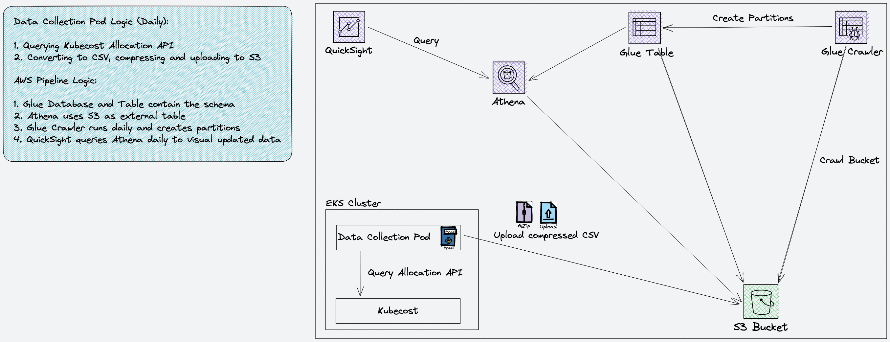

# Kubecost CID Integration

This is an integration of Kubecost with AWS CID (Cloud Intelligence Dashboards), means to provide the users with a dashboard to view a breakdown of their EKS clusters costs, in a single-pane-of-glass with their other dashboards.

## Architecture

The following is the solution's architecture:

The solution deploys the following resources:

1. CronJob and Service Account in your EKS cluster
2. The following AWS resources: 
IAM Role for Service Account__
Glue Database__
Glue Table__
Glue Crawler (along with its IAM Role, IAM Policy, CloudWatch Log Group and CloudWatch Log Stream)

The CronJob runs daily and collects cost allocation data from Kubecost.
It runs the [Allocation API on-demand query](https://docs.kubecost.com/apis/apis/allocation#querying-on-demand-experimental) to retrieve the cost allocation data.
It always collects the data between 72 hours ago 00:00:00 and 48 hours ago 00:00:00.
It then converts the data to a CSV, compresses it and uploads it to an S3 bucket of your choice.
The data is made available in Athena, and QuickSight uses the Athena table as a data source to visualize the data.

## Requirements

 1. An EKS cluster
 2. Kubecost deployed in the EKS cluster
 3. An S3 bucket
 4. QuickSight Enterprise with CID deployed
 5. The `cid-cmd` tool

## Deployment

There are 3 high-level steps to deploy the solution:

1. Build an image using `Dockerfile` and push it
2. Deploy both the AWS resources and the data collection pod using Terraform and Helm
3. Deploy the QuickSight dashboard using `cid-cmd` tool

### Step 1: Build and Push the Container Image

We do not provide a public image, so you'll need to build an image and push it to the registry and repository of your choice.
In this section, choose either "Build and Push for a Single Platform" or "Build and Push for Multiple Platforms".

#### Build and Push for a Single Platform

Build for a platform as the source machine:

    docker build -t <your_registry_url>/<your_repo>:<tag> .

Build for a specific target platform:

    docker build --platform linux/amd64 -t <your_registry_url>/<your_repo>:<tag> .

Push:

    docker push <your_registry_url>/<your_repo>:<tag>

#### Build and Push for Multiple Platforms

    docker buildx build --push --platform linux/amd64,linux/arm64/v8 --tag <your_registry_url>/<your_repo>:<tag> .

### Step 2: Deploy the AWS and K8s Resources

#### Provide Terraform Inputs

Edit `terraform/terraform_aws_helm_resources/locals.tf` and provide at least the required inputs.
The below table lists the required and optional inputs from the `locals.tf` file:

| Input | Default | Description | Supported Values
|--|--|--|--|
| region (required) |  | The AWS region to deploy the resources (it doesn't have to be the same region as the EKS cluster | AWS Region code (for example, `us-east-1` |
| eks_oidc_url (required) |  | The EKS OIDC URL  |  |
| bucket_arn (required) |  | the ARN of the bucket to which the CSV files will be written |  |
| image (required) |  | The registry, repository and tag to pull (`<your_registry_url>/<your_repo>:<tag>`) |  |
| cluster_name (required) |  | Your EKS cluster name |  |
| k8s_config_path | `~/.kube/config` | Full path of the K8s config file |  |
| k8s_namespace | `kubecost-s3-exporter` | The namespace to use for the data collection pod |  |
| k8s_service_account | `kubecost-s3-exporter` | The K8s service account name |  |
| k8s_create_namespace | `true` | Specifies whether to create the namespace | `true`, `false` |
| image_pull_policy | `Always` | Specifies the image pull policy | `Always`, `IfNotPresent`, `Never` |
| schedule | `0 0 * * *` | Cron schedule (in UTC) | Any Cron schedule |
| kubecost_api_endpoint | `http://kubecost-cost-analyzer.kubecost:9090` | The Kubecost API endpoint URL and port | `http://<host>:<port>` |
| granularity | `hourly` | The granularity of the collected data | `hourly`, `daily` |
| k8s_labels | `[]` | A list of labels (as strings) to include in the CSV | For example: `["app", "chart"]` |

Notes:

1. The `region` specifies where to create the AWS resources for the data collection pod. It doens't have to be the same as the region where the EKS cluster is
2. Cron always runs in UTC, so the `schedule` input is in UTC. For example, if you specify `0 0 * * *` (daily at 00:00:00am), and you're in GMT +2, the CronJob will run daily at 02:00:00am and not daily at 00:00:00am

#### Apply the Terraform Template

From `terraform/terraform_aws_helm_resources`, run `terraform apply`.
It'll deploy both the AWS resources, and invoke Helm to deploy the CronJob and Service Account.

### Step 3: Deploy the Dashboard

#### Deploy the Dashboard from the CID YAML File

From the `cid` folder, run `cid-cmd deploy --resources kubecost_v0.1.0.yaml`.
When prompted, choose `Kubecost`, then choose the Athena table (this is the same as the Glue Table that was created by Terraform)

#### Set Dataset Refresh Schedule

We need to create a dataset refresh schedule, so that the data from Athena will be fresh in QuickSight.

1. Login to QuickSight
2. Under "Datasets", edit the `Kubecost`
3. Under "Schedule" tab, create a schedule. We recommend setting to 1 hour after the CronJob schedule time

## Cleanup

### QuickSight Cleanup

1. Delete any analysis you created from the dashboard
2. Delete the dashboard
3. Delete the dataset
4. Delete the datasource

### AWS and K8s Resources Cleanup

1. From `terraform/terraform_aws_helm_resources`, run `terraform destroy`.
It'll remove both the AWS resources, and invoke Helm to remove the CronJob and Service Account.
2. Run `kubectl delete ns <namespace>` to remove the namespace
