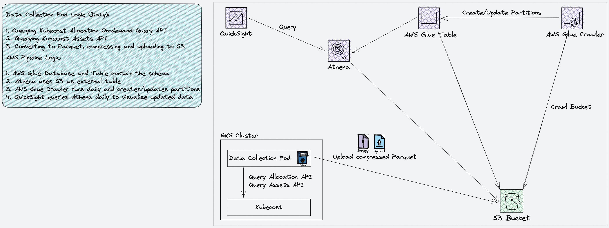

# Kubecost CID Integration

This is an integration of Kubecost with AWS CID (Cloud Intelligence Dashboards), means to provide the users with a dashboard to view a breakdown of their EKS clusters costs, in a single-pane-of-glass with their other dashboards.

## Architecture

The following is the solution's architecture:

The solution deploys the following resources:

1. Data collection Pod (deployed using a CronJob controller) and Service Account in your EKS cluster
2. The following AWS resources: 
IAM Role for Service Account 
Glue Database 
Glue Table 
Glue Crawler (along with its IAM Role and IAM Policy)

High-level logic:

1. The CronJob runs daily and creates a Pod that collects cost allocation data from Kubecost. 
It runs the [Allocation API on-demand query (experimental)](https://docs.kubecost.com/apis/apis/allocation#querying-on-demand-experimental) to retrieve the cost allocation data. 
It always collects the data between 72 hours ago 00:00:00 and 48 hours ago 00:00:00. 
2. Once data is collected, it's then converted to a CSV, compressed and uploaded to an S3 bucket of your choice. This is when the CronJob finishes 
3. The data is made available in Athena using Glue. In addition, a Glue Crawler runs daily, 1 hour after the CronJob started, to create or update partitions
4. QuickSight uses the Athena table as a data source to visualize the data

## Requirements

 1. An EKS cluster, and an [IAM OIDC Provider](https://docs.aws.amazon.com/eks/latest/userguide/enable-iam-roles-for-service-accounts.html)
 2. Kubecost deployed in the EKS cluster
 3. An S3 bucket
 4. QuickSight Enterprise with CID deployed
 5. The `cid-cmd` tool ([install with PIP](https://pypi.org/project/cid-cmd/))

## Deployment

There are 3 high-level steps to deploy the solution:

1. Build an image using `Dockerfile` and push it
2. Deploy both the AWS resources and the data collection CronJob using Terraform and Helm
3. Deploy the QuickSight dashboard using `cid-cmd` tool

### Step 1: Build and Push the Container Image

We do not provide a public image, so you'll need to build an image and push it to the registry and repository of your choice. 
In this section, choose either "Build and Push for a Single Platform" or "Build and Push for Multiple Platforms".

#### Build and Push for a Single Platform

Build for a platform as the source machine:

    docker build -t <registry_url>/<repo>:<tag> .

Build for a specific target platform:

    docker build --platform linux/amd64 -t <registry_url>/<repo>:<tag> .

Push:

    docker push <registry_url>/<repo>:<tag>

#### Build and Push for Multiple Platforms

    docker buildx build --push --platform linux/amd64,linux/arm64/v8 --tag <registry_url>/<repo>:<tag> .

### Step 2: Deploy the AWS and K8s Resources

#### Provide Terraform Inputs

Edit `terraform/terraform_aws_helm_resources/locals.tf` and provide at least the required inputs. 
The below table lists the required and optional inputs from the `locals.tf` file:

| Input | Default | Description | Supported Values
|--|--|--|--|
| region (required) |  | The AWS region to deploy the resources (it doesn't have to be the same region as the EKS cluster | AWS Region code (for example, `us-east-1` |
| eks_iam_oidc_provider_arn (required) |  | The EKS IAM OIDC Provider ARN. Retrieve by navigating to IAM console -> Access management -> Identity providers -> click on the provider for the EKS cluster -> copy the value of "ARN" |  |
| bucket_arn (required) |  | the ARN of the bucket to which the CSV files will be written |  |
| image (required) |  | The registry, repository and tag to pull (`<registry_url>/<repo>:<tag>`) |  |
| cluster_name (required) |  | Your EKS cluster name |  |
| k8s_config_path | `~/.kube/config` | Full path of the K8s config file |  |
| k8s_namespace | `kubecost-s3-exporter` | The namespace to use for the data collection pod |  |
| k8s_service_account | `kubecost-s3-exporter` | The K8s service account name |  |
| k8s_create_namespace | `true` | Specifies whether to create the namespace | `true`, `false` |
| image_pull_policy | `Always` | Specifies the image pull policy | `Always`, `IfNotPresent`, `Never` |
| schedule | `0 0 * * *` | Cron schedule (in UTC) | Any Cron schedule |
| kubecost_api_endpoint | `http://kubecost-cost-analyzer.kubecost:9090` | The Kubecost API endpoint URL and port | `http://<host>:<port>` |
| granularity | `hourly` | The granularity of the collected data | `hourly`, `daily` |
| k8s_labels | `[]` | A list of labels (as strings) to include in the CSV | For example: `["app", "chart"]` |

Notes:

1. The `region` specifies where to create the AWS resources for the data collection pod. It doesn't have to be the same as the region where the EKS cluster is
2. Cron always runs in UTC, so the `schedule` input is in UTC. For example, if you specify `0 0 * * *` (daily at 00:00:00am), and you're in GMT +2, the CronJob will run daily at 02:00:00am and not daily at 00:00:00am

#### Apply the Terraform Template

From `terraform/terraform_aws_helm_resources`, run `terraform apply`. 
It'll deploy both the AWS resources, and invoke Helm to deploy the CronJob and Service Account.

### Step 3: Dashboard Deployment and Configuration

#### Deploy the Dashboard from the CID YAML File

From the `cid` folder, run `cid-cmd deploy --resources kubecost_v0.1.0.yaml`. 
The output should be similar to the below:

    CLOUD INTELLIGENCE DASHBOARDS (CID) CLI 0.2.3 Beta
    
    Loading plugins...
        Core loaded
        Internal loaded
    
    
    Checking AWS environment...
        profile name: <>
        accountId: <account_id>
        AWS userId: <user_id>
        Region: <region>
    
    
    
    ? [dashboard-id] Please select dashboard to install: (Use arrow keys)
     » [cudos] CUDOS Dashboard
       [cost_intelligence_dashboard] Cost Intelligence Dashboard
       [kpi_dashboard] KPI Dashboard
       [ta-organizational-view] Trusted Advisor Organizational View
       [trends-dashboard] Trends Dashboard
       [compute-optimizer-dashboard] Compute Optimizer Dashboard
       [kubecost] Kubecost Dashboard

From the list, choose `[Kubecost] Kubecost Dashboard`. 
After choosing, wait for dashboards discovery to be completed, and then the additional output should be similar to the below:

    ? [dashboard-id] Please select dashboard to install: [kubecost] Kubecost Dashboard
    Discovering deployed dashboards...  [####################################]  100%  "CUDOS Dashboard" (cudos)
    
    Required datasets:
     - kubecost
    
    
    Looking by DataSetId defined in template...complete
    
    There are still 1 datasets missing: kubecost
    Creating dataset: kubecost
    Detected views:
    
    ? [athena-database] Select AWS Athena database to use: (Use arrow keys)
     » athenacurcfn_udid_cur1
       kubecost_db
       spectrumdb

From the list, choose the Athena database that was created by the Terraform template. 
If you didn't change the Glue Database name in the Terraform template, then it'll be `kubecost_db` - please choose it.
After choosing, wait for the dataset to be created, and then the additional output should be similar to the below:

    ? [athena-database] Select AWS Athena database to use: kubecost_db
    Dataset "kubecost" created
    Latest template: arn:aws:quicksight:us-east-1:742719403826:template/kubecost/version/2
    Deploying dashboard kubecost
    
    #######
    ####### Congratulations!
    ####### Kubecost Dashboard is available at: https://us-east-1.quicksight.aws.amazon.com/sn/dashboards/kubecost
    #######
    
    ? [share-with-account] Share this dashboard with everyone in the account?: (Use arrow keys)
     » yes
       no

Choose whether to share the dashboard with everyone in this account. 
This selection will complete the deployment.

#### Share the Dataset with Users

Share the dataset with users that are authorized to make changes to it:

1. Login to QuickSight, then click on the person icon on the top right, and click "Manage QuickSight"
2. On the left pane, navigate to "Manage assets", then choose "Datasets"
3. From the list, choose the `kubecost` dataset (ID `e88edf48-f2cd-4c23-b6a4-e2b3034e2c41`)
4. Click "Share", select the desired permissions, start typing your user or group, select it and click "Share"

#### Set Dataset Refresh Schedule

A dataset refresh schedule needs to be set, so that the data from Athena will be fresh daily in QuickSight:

1. Login to QuickSight as a user that has "Owner" permissions to the dataset (you set it in the previous step)
2. Navigate to "Datasets" and click on the `Kubecost` dataset
3. Under "Refresh" tab, click "ADD NEW SCHEDULE"
4. Make sure that "Full refresh" is selected
5. Set the refresh schedule to be at least 2 hours after the K8s CronJob schedule (because 1 hour after the CronJob runs, the Glue Crawler runs), and click "Save"

#### Share the Dashboard with Users

Share the dashboard with users, for them to be able to view it and create Analysis from it:

1. Login to QuickSight
2. Navigate to "Dashboards" and click the `Kubecost Dashboard`
3. On the top right, click the "Share" icon, then click "Share dashboard"
4. In the "Invite users and groups to dashboard", search for users to share the dashboard with, and add them
5. For users that require Analysis creation (to edit the dashboard), tick the `Allow "save as"` button under "Save as Analysis" column, then click "Confirm"
6. Navigate back to the dashboard once done, by clicking "← Go back to 'Kubecost Dashboard'" on the top left

#### Create an Analysis from the Dashboard

Create an Analysis from the Dashboard, to edit it and create custom visuals:

1. Login to QuickSight as a user that is allowed to save the dashboard as Analysis
2. Navigate to "Dashboards" and click the `Kubecost Dashboard`
3. On the top right, click the "Save as" icon (refresh the dashboard if you don't see it), name the Analysis, then click "SAVE" - you'll be navigated to the Analysis
4. You can edit the Analysis as you wish, and save it again as a dashboard, by clicking the "Share" icon on the top right, then click "Publish dashboard"

## Cleanup

### QuickSight Cleanup

1. Delete any analysis you created from the dashboard
2. Delete the dashboard
3. Delete the dataset

### AWS and K8s Resources Cleanup

1. From `terraform/terraform_aws_helm_resources`, run `terraform destroy`. 
It'll remove both the AWS resources, and invoke Helm to remove the CronJob and Service Account.
2. Manually remove the CloudWatch Log Stream that was created by the Glue Crawler
3. Empty and delete the S3 bucket you created
4. Run `kubectl delete ns <namespace>` to remove the K8s namespace
